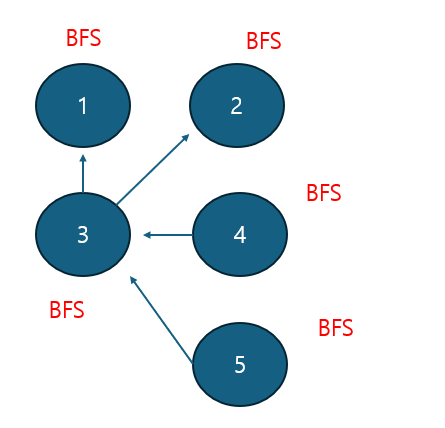

### [Effective Hacking](https://www.acmicpc.net/problem/1325)

Difficulty : Silver 1

#### statement
Hacker Kim Ji-min is trying to hack a well-known company. The company consists of N computers. Kim Ji-min is lazy, so he tries to hack a computer that can hack multiple computers with one hack.

This company's computers are made up of trusted and untrusted relationships. If A trusts B, then hacking B means hacking A.

Given the trust relationships of the company's computers, write a program that outputs the number of computers that can hack the most computers at once.


#### Input
In the first line, N and M are entered. N is a natural number less than or equal to 10,000, and M is a natural number less than or equal to 100,000. In the second line and the M lines thereafter, trust relationships are entered in the form AB, meaning "A trusts B." The computers are numbered from 1 to N.


#### Output
On the first line, print the numbers of the computers that Kim Ji-min can hack the most at one time, in ascending order.

>**IDEA**

The key is finding the most trusted computer. From each node, we do BFS search with reseting the visited variable. As we check one point, we add up the number from 1 to the answer list. 
<br>In the last step, we find the index whose value is the smae as maximum value. The key point is that we do BFS search at every nodes. 




>**How I solve it**

```python
from collections import deque
N, M = map(int, input().split())
lis = [0] * (N+1) # lis = [0,0,0,0,0,0]
A = [[] for _ in range(N+1)] # A = [[],[],[],[1,2],[3],[3]]

for _ in range(M):
    S, E = map(int, input().split())
    A[S].append(E)

def BFS(v):
    visited = [False] * (N+1)
    queue = deque([v])
    visited[v] = True
    
    while queue:
        value = queue.popleft()
        
        for i in A[value]:
            if not visited[i]:
                lis[i] += 1
                queue.append(i)
                visited[i] = True
            
for i in range(1, N+1):
    if A[i]:
        BFS(i)

a = max(lis)
for i in range(1, N+1):
    if lis[i] == a:
        print(i, end = ' ')

```